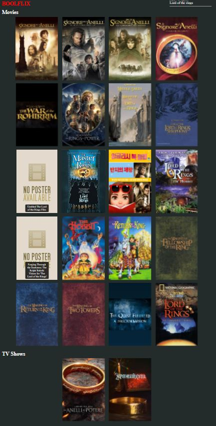

# Vue 3 + Vite + SASS
Applicazione creata usando VueJS 3, Vite e SASS. Le API sono fornite da https://developers.themoviedb.org/3

## Descrizione
In questa applicazione è possibile cercare un film/serie TV e avere informazioni su di esso.

## Come funziona?
Nell'header è presente una barra di ricerca che permette di inserire il titolo di un film o una serie tv. La ricerca viene avviata premendo enter sulla tastiera. La barra cambia aspetto in base allo stato di focus

Senza focus : 

Con focus : 

## Risultati ottenuti
Avviando la ricerca, apparà una card per ogni film / serie trovata con la possibilità di fare hover con il mouse per visualizzare informazioni su di esso.

Card senza hover:

Card con hover:

## Problemi risolti
Le API forniscono un poster che a volte potrebbe mancare. Per risolvere questo problema è stata inserita un immagine di default.

Immagine default

